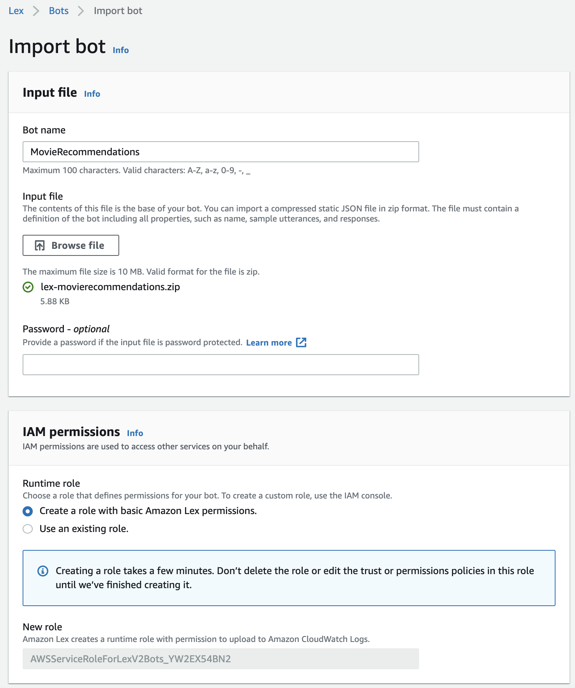
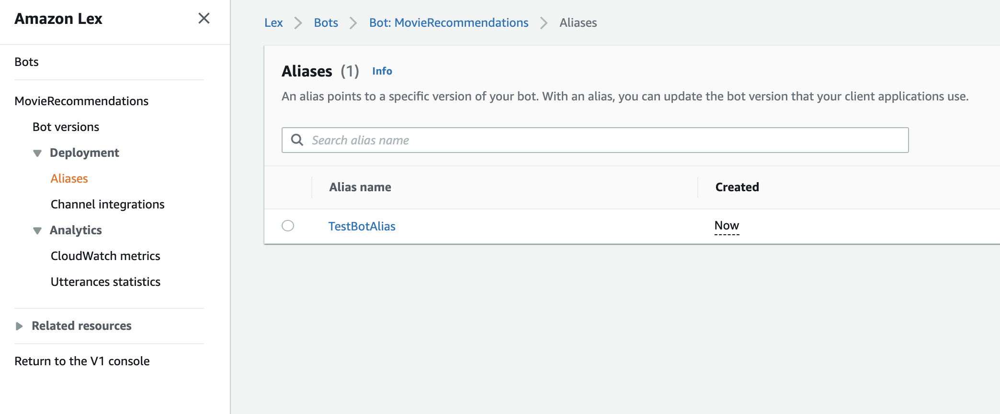
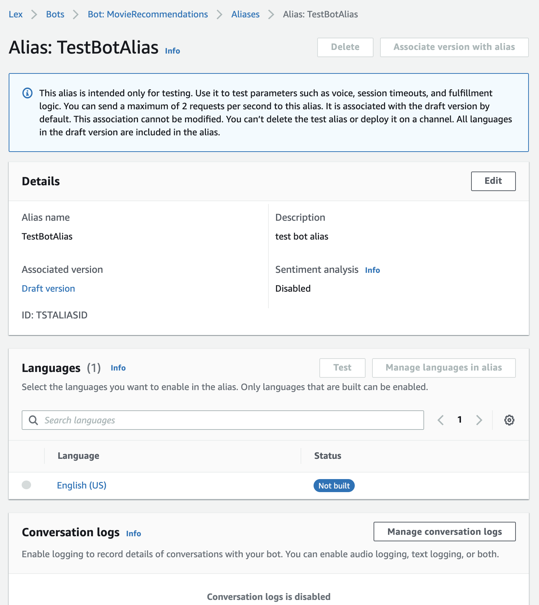
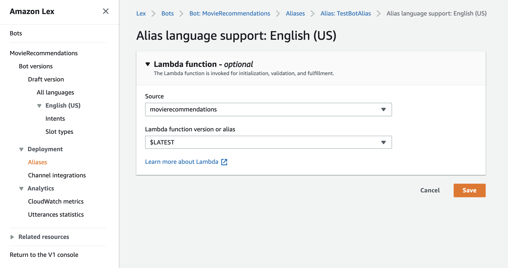
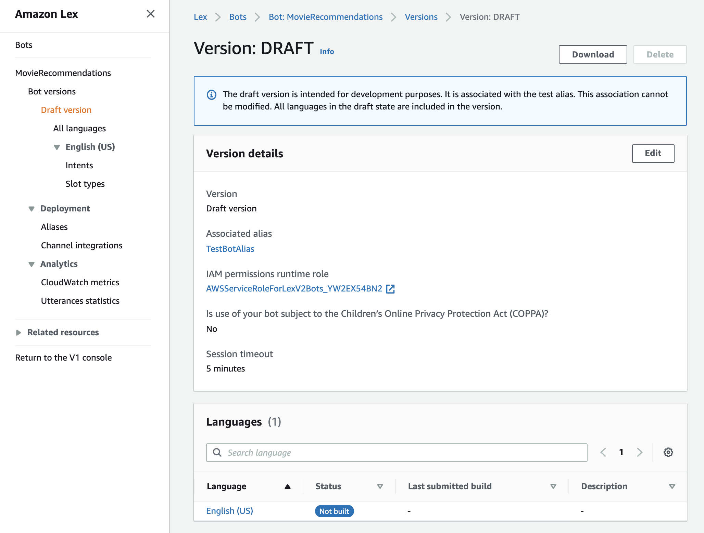
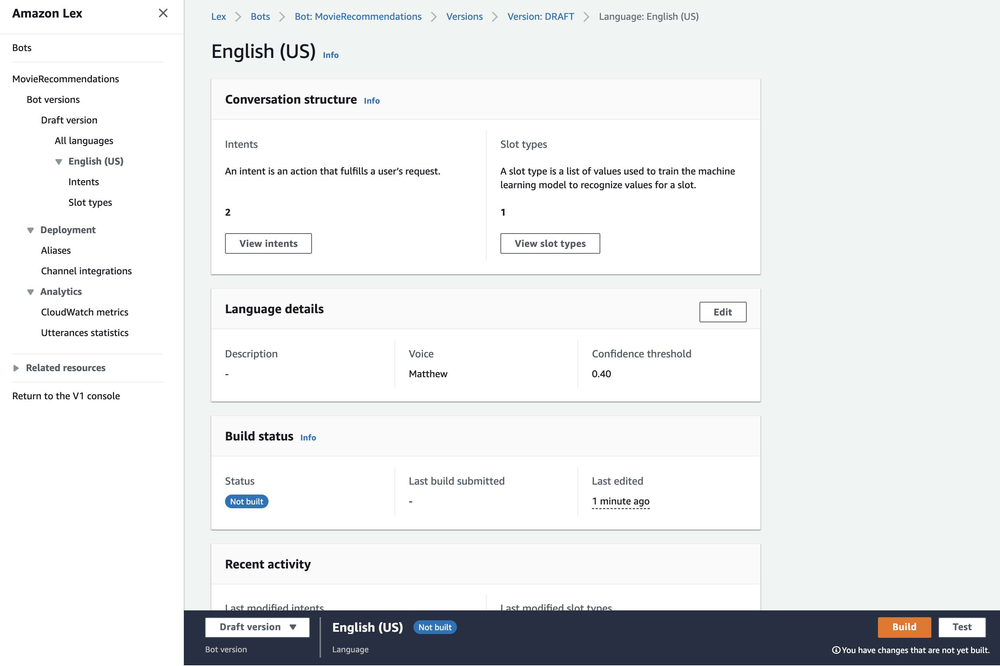
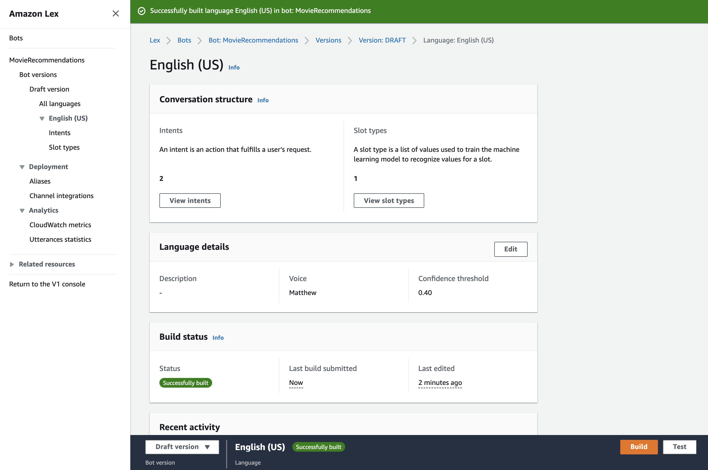
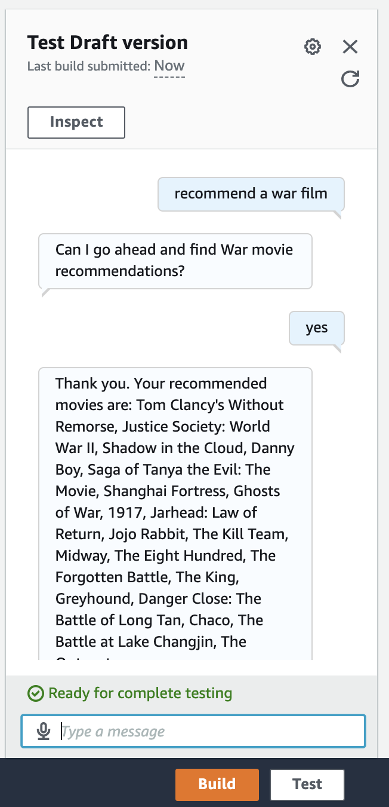

# Amazon Lex Movie Recommendations Chatbot

## Introduction
A simple Amazon Lex (v2) Chatbot that is able to provide movie recommendations for a given movie genre. 

## Integration
Movie recommendation data is provided by The Movie Database ([TMDB](https://www.themoviedb.org/)). 


The chatbot integrates with [TMDB API](https://developers.themoviedb.org/3) endpoint using a custom AWS [Lambda Function](./lambda/lambda_function.py) developed in Python3.

## Installation
1. Register for a TMDB API key
2. Within the **install.sh** file, update the ```APIKEY``` variable:

**install.sh**:
```
APIKEY=TMDB_API_KEY_HERE
```
3. Execute the **install.sh** script
4. Log in to the AWS Lex console and then import the newly created **lex-movierecommendations.zip** package




Set the following options:

- **Bot name**, enter ```MovieRecommendations```

- **IAM permissions**, select **create a role with basic Amazon Lex permissions**

- **Childrens Online Privacy Protection Act**, select **No**

5. After the import has succeeded - in the lefthand menu navigate to **Deployment/Aliases** for the newly created **MovieRecommendations** bot and click on the **TestBotAlias**



6. Within the **TestBotAlias** click on the **English** language



7. Select **movierecommendations** for **Source**, and **$LATEST** for **Lambda function version or alias**. Click Save.



8. In the lefthand menu navigate to **Bot versions/Draft version**, and then under **Languages** click on the **English** language link.



9. In the bottom menu bar click on the **build** button to compile the MovieRecommendations Chatbot.



10. Confirm that the MovieRecommendations Chatbot build has completed successfully.



11. Confirm that the MovieRecommendations Chatbot build has completed successfully, and then click on the **Test** button to activate the Chatbot.

12. Within the Chatbot test pane, enter any of the following utterances to start the Chatbot conversation:

```
recommend a movie
recommend a {genre} movie
recommend a {genre} film
I want to watch a movie
I want to watch a {genre} movie
```

Note: The following movie genres are supported:

```
Action
Adventure
Animation
Comedy
Crime
Documentary
Drama
Family
Fantasy
History
Horror
Music
Mystery
Romance
Science Fiction
Thriller
War
Western
```

Example Chatbot conversation:


